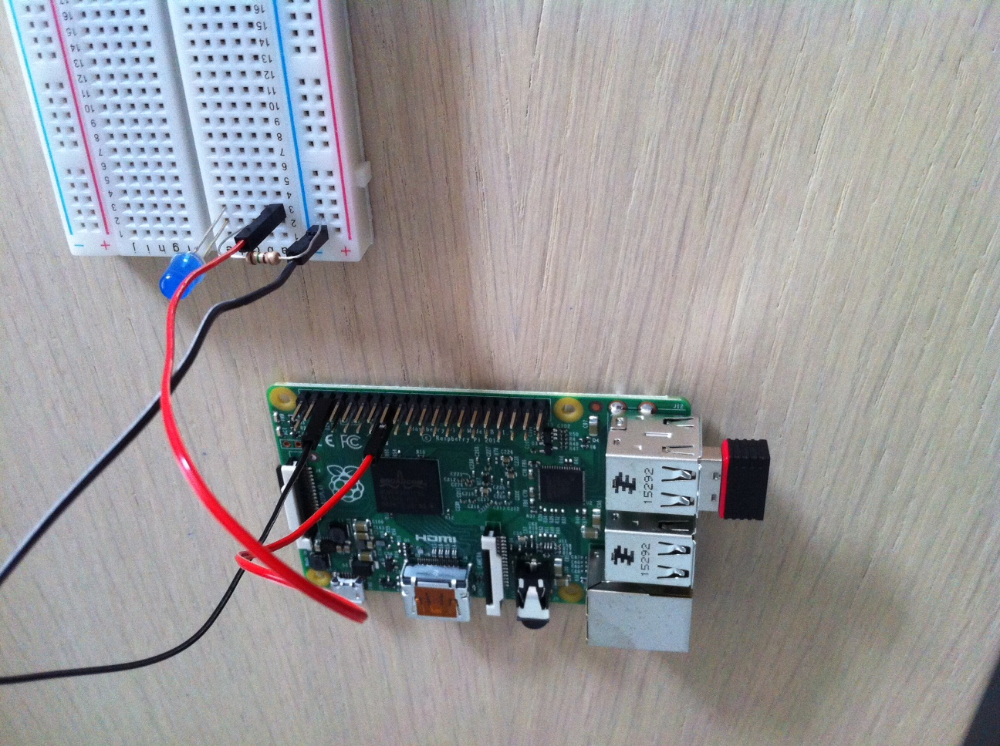

# testLDArpi
Test LDA algorithm with nodejs in raspberry pi 2

Just a simple invocation to LDA algorithm that gets a bunch of tweets and outputs some topics.
When it finishes, the led is on for 3 secs.

